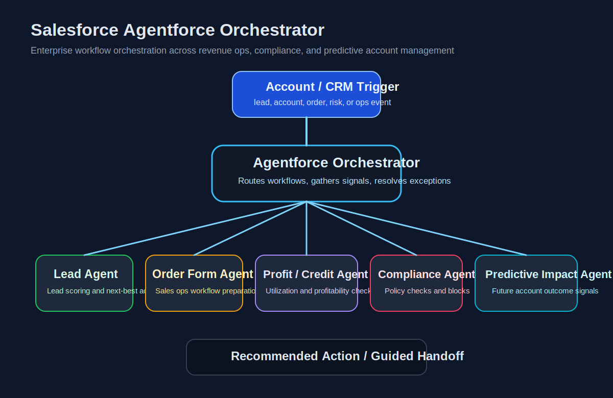

# Salesforce Agentforce Orchestrator

A portfolio-safe overview of an Agentforce implementation on Salesforce CRM designed to coordinate multiple specialized agents across revenue operations, account governance, and predictive decision support.



## What this project is about
This repository documents a practical enterprise AI orchestration pattern: an orchestrator agent coordinating multiple task-specific agents to convert fragmented business workflows into structured, autonomous actions while preserving controls around profitability and compliance.

## Problem
Revenue and account operations often break across disconnected workflows:
- lead generation insights live separately from execution
- sales operations teams manually create order forms
- profitability and credit line checks are slow or inconsistent
- compliance checks add friction late in the process
- future account impact is difficult to predict early enough for action

The result is slower execution, inconsistent judgment, and manual dependence across teams.

## Solution overview
The Agentforce setup uses a central orchestrator to route tasks, gather signals, and coordinate agents responsible for distinct operational jobs.

### Coordinated agent flows
- **Lead Generation Agent**
  - identifies and qualifies leads based on account context and opportunity signals
- **Order Form Creation Agent**
  - supports sales operations by preparing structured order form inputs and workflow handoffs
- **Profitability & Credit Monitoring Agent**
  - tracks account profitability, revenue realization, and credit line utilization
- **Compliance & Guardrail Agent**
  - validates accounts against business controls, policy thresholds, and risk/profitability checks
- **Predictive Impact Agent**
  - estimates likely future account impact to support prioritization and account strategy

## Orchestration logic
At a high level, the orchestrator:
1. receives an account, lead, or ops trigger
2. determines which specialized agents should run
3. gathers outputs from profitability, compliance, and operational agents
4. resolves conflicts or escalates exceptions
5. returns a guided action, recommendation, or workflow handoff

## Representative business use cases
- Prioritize leads with stronger downstream revenue potential
- Generate order-form workflows faster with fewer manual dependencies
- Detect low-profit or high-risk account patterns before intervention is too late
- Block or flag actions that fail compliance or profitability thresholds
- Forecast account impact to support resource allocation and growth planning

## Product value
- reduces manual handoffs across sales, ops, and account teams
- improves consistency of decision-making
- embeds profitability and compliance checks earlier in workflows
- creates a path from CRM data to guided action, not just reporting
- helps business teams act on predictive signals instead of reviewing dashboards passively

## Architecture sketch
```text
[CRM / account trigger]
          |
          v
[Agentforce Orchestrator]
   |        |        |        |        |
   v        v        v        v        v
[Lead]  [Order] [Profit] [Compliance] [Predictive]
 Agent   Agent   Agent      Agent        Agent
   \        |        |        |        /
    \_______|________|________|_______/
                    |
                    v
         [recommended action / handoff]
```

## PM lens
This project demonstrates:
- agent orchestration in an enterprise workflow
- AI-assisted decision systems with business guardrails
- applied AI in CRM and revenue operations
- balancing autonomy with control and auditability
- connecting predictive intelligence to operational action

## Portfolio-safe notes
This repo intentionally avoids confidential business logic, internal data, and proprietary implementation details. It is meant to showcase architecture, product thinking, and real-world applied AI design.

## Recruiter-friendly reading path
- `README.md` — quick overview and architecture summary
- `docs/case-study.md` — business problem, product decisions, and impact framing
- `docs/prd.md` — product requirements and KPI view
- `docs/architecture.md` — deeper design notes
- `docs/use-cases.md` — representative workflows

## Possible next additions
- sample workflow specs
- pseudo-PRDs for each agent
- evaluation metrics for agent quality and business impact
- example exception handling flows
